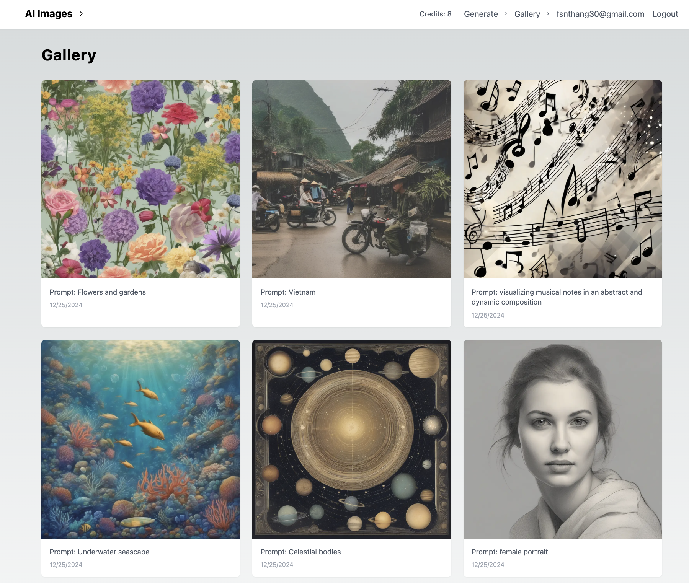
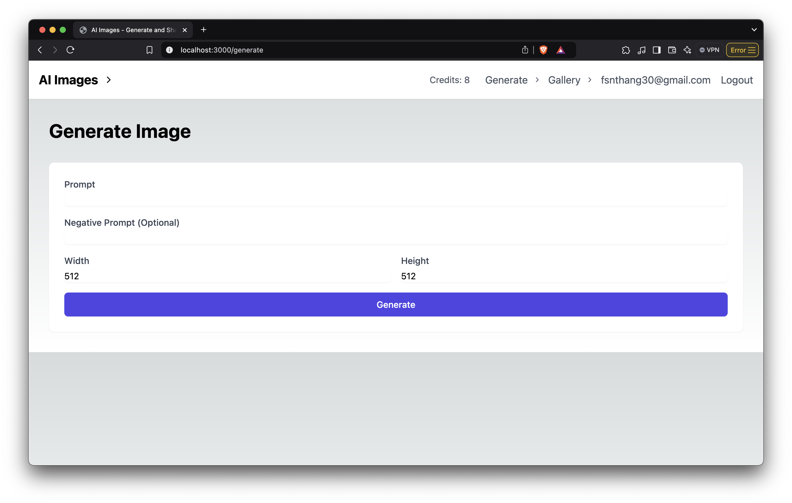

# AI Image Generation App

A Next.js 15 application for generating and sharing AI-powered images using Vercel Postgres, Drizzle ORM, and FAL.ai. Checkout the live demo: [ai-images-alpha.vercel.app](https://ai-images-alpha.vercel.app/)

## Features

- 🎨 AI Image Generation with FAL.ai
- 🔐 User Authentication
- 💳 Credit System
- 🖼️ Personal Image Gallery
- 📱 Responsive Design




## Tech Stack

- **Framework**: [Next.js 15](https://nextjs.org/)
- **Database**: [Vercel Postgres](https://vercel.com/postgres)
- **ORM**: [Drizzle](https://orm.drizzle.team/)
- **AI**: [FAL.ai](https://fal.ai/)
- **Storage**: [Tigris](https://www.tigrisdata.com/)
- **Styling**: [Tailwind CSS](https://tailwindcss.com/)
- **Animation**: [Framer Motion](https://www.framer.com/motion/)

## Getting Started

1. Clone the repository:

```bash
git clone https://github.com/Thang30/ai-image-app.git
```

2. Install dependencies:

```bash
npm install
```

or  

```bash
pnpm install
```

3. Set up environment variables:

```bash
cp .env.example .env
```

4. Run the development server:

```bash
npm run dev
```

or  

```bash
pnpm dev
```

## Environment Variables

```bash
POSTGRES_URL=your_postgres_url
POSTGRES_URL_NON_POOLING=your_postgres_url_non_pooling
POSTGRES_USER=your_postgres_user
POSTGRES_HOST=your_postgres_host
POSTGRES_PASSWORD=your_postgres_password
POSTGRES_DATABASE=your_postgres_database
FAL_KEY=your_fal_key
AWS_ACCESS_KEY_ID=your_aws_access_key_id
AWS_SECRET_ACCESS_KEY=your_aws_secret_access_key
AWS_ENDPOINT_URL_S3=your_aws_endpoint_url_s3
AWS_ENDPOINT_URL_IAM=your_aws_endpoint_url_iam
AWS_REGION=your_aws_region
```
